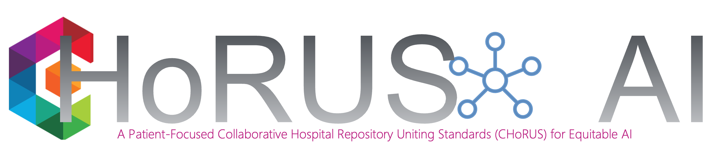

The CHoRUS Data Generating Project (DGP) within the Bridge2AI research consortium has produced a powerful set of software and tooling to support multimodal analytics on healthcare data.

This site serves as a portal for contributors to and users of that codebase, with the intention of tracking package versions and locations, and best practices, within the chorus-ai organization.

# Get Started: Contributors

If you'd like to contribute to the software, take a look at the [contribution resources](contribute.html) and other developer information!

It is also worth looking at [package statuses](packageStatuses.html) to see what packages have been produced and who is actively maintaining them.

# Get Started: Users

The [package overview](packages.html) is a great place to identify CHoRUS software tools that suit your needs.

More to come...